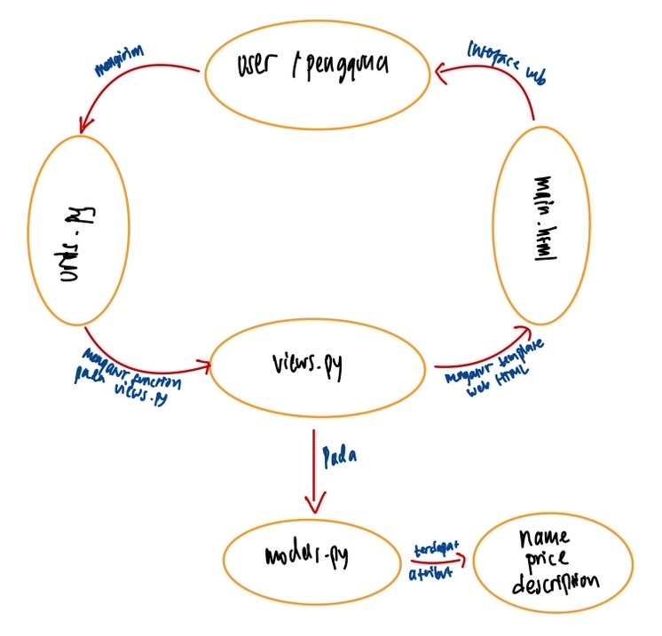
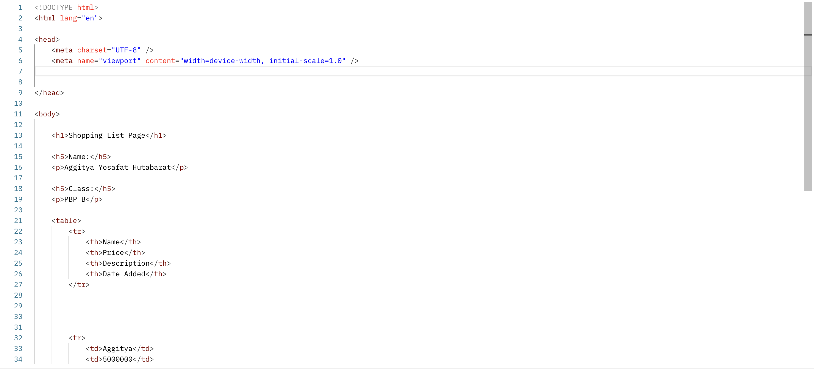
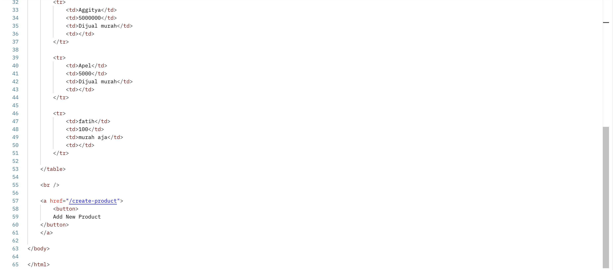
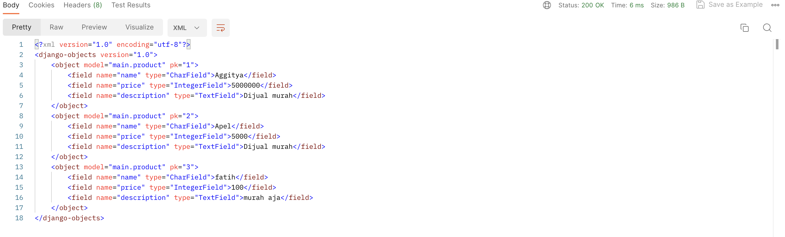
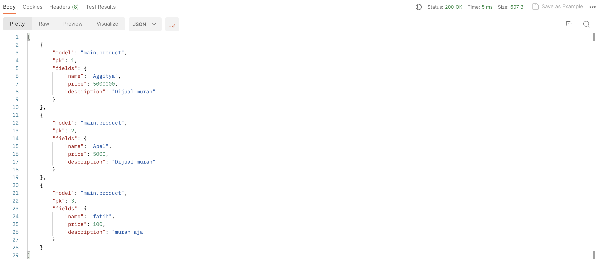
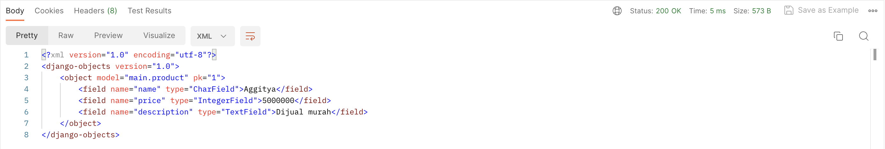
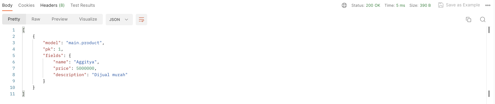
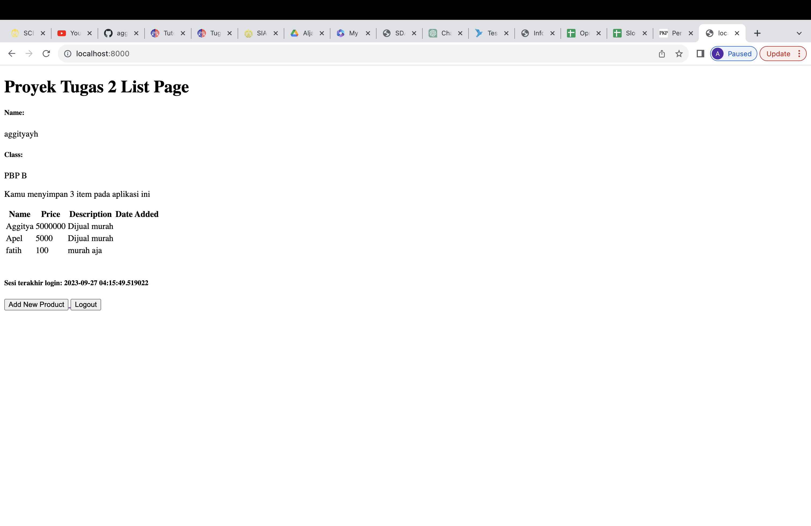
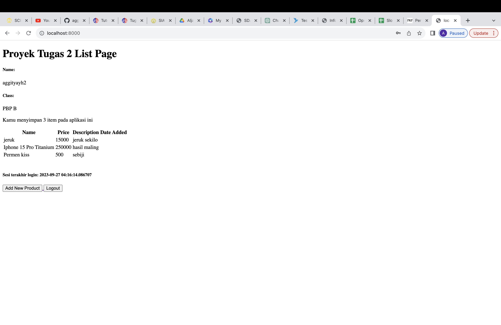

--- START TUGAS 2 ---

Jelaskan bagaimana cara kamu mengimplementasikan checklist di atas secara step-by-step (bukan hanya sekadar mengikuti tutorial).
Jawaban:
Untuk memulai proyek Django baru, ikuti langkah-langkah berikut:
1. Buat virtual environment dengan perintah python -m venv env.
2. Aktifkan virtual environment dengan perintah env\Scripts\activate.
3. Buat file requirements.txt untuk daftar dependensi proyek Anda.
4. Jalankan perintah pip install -r requirements.txt untuk menginstal dependensi yang diperlukan.
5. Mulai proyek Django dengan perintah django-admin startproject proyek_pbp.
6. Untuk pengaturan deployment, tambahkan "*" pada ALLOWED_HOSTS di dalam settings.py.
7. Pastikan untuk menambahkan file .gitignore untuk menentukan berkas-berkas dan direktori-direktori yang tidak perlu disertakan dalam repositori Git.
8. Buat aplikasi dengan perintah python manage.py startapp main.
9. Di dalam direktori main, buat folder templates dan tambahkan file main.html sebagai tampilan aplikasi.
10. Lakukan routing untuk aplikasi main dengan menambahkan path('main/', include('main.urls')) pada urls.py di dalam proyek library_col.
11. Buat model Item di dalam aplikasi main dengan atribut wajib: name (CharField), amount (IntegerField), dan description (TextField).
12. Tambahkan fungsi show_main pada views.py yang akan merender template HTML dengan konteks nama aplikasi, nama, dan kelas Anda.
13. Lakukan deployment ke Adaptable untuk memungkinkan teman-teman Anda mengaksesnya melalui Internet.
14. Lakukan add, commit, dan push dari direktori repositori lokal ke GitHub.
15. Ikuti petunjuk Tutorial 0 untuk melakukan deploy dari website Adaptable.
Semua langkah di atas akan membantu Anda memulai proyek Django baru dan melakukan deployment ke Adaptable.

Buatlah bagan yang berisi request client ke web aplikasi berbasis Django beserta responnya dan jelaskan pada bagan tersebut kaitan antara urls.py, views.py, models.py, dan berkas html.
Jawaban:

Jelaskan mengapa kita menggunakan virtual environment? Apakah kita tetap dapat membuat aplikasi web berbasis Django tanpa menggunakan virtual environment?
Jawaban:
Virtual environment adalah komponen kunci dalam pengembangan aplikasi web Django karena memberikan isolasi proyek yang memungkinkan pengelolaan dependensi secara efisien. Dengan menggunakan virtual environment, setiap proyek dapat memiliki lingkungan Python dan dependensi tersendiri yang terisolasi, menghindari potensi konflik dan masalah versi. Ini juga menyederhanakan tata kelola dependensi proyek.
Selain manfaat tersebut, penggunaan virtual environment juga meningkatkan keamanan proyek dengan mencegah potensi konflik antara paket-paket yang digunakan dalam proyek berbeda. Secara keseluruhan, penggunaan virtual environment adalah praktik terbaik dalam pengembangan aplikasi Django karena memastikan kebersihan, isolasi, dan manajemen dependensi yang efisien.

Jelaskan apakah itu MVC, MVT, MVVM dan perbedaan dari ketiganya.
Jawaban:
Model-View-Controller (MVC), Model-View-Template (MVT), dan Model-View-ViewModel (MVVM) adalah pola desain arsitektur yang digunakan dalam pengembangan perangkat lunak.
MVC membagi aplikasi menjadi tiga komponen utama: Model (penyimpanan data dan logika aplikasi), View (menampilkan data dari Model dan menghubungkannya dengan template), dan Controller (mengontrol tampilan antarmuka pengguna).
MVT, sejenis dengan MVC, memisahkan aplikasi menjadi Model (menyimpan data dan logika), View (menampilkan data dari Model dan menghubungkannya dengan template), dan Template (mengelola tampilan HTML dan cara data dari Model ditampilkan dalam halaman web).
MVVM juga memisahkan aplikasi menjadi Model (menyimpan data dan logika), View (menampilkan data dari Model dan menghubungkannya dengan template), dan memperkenalkan ViewModel. ViewModel bertanggung jawab untuk memproses data dari Model dan mempersiapkannya agar dapat ditampilkan oleh View. Hal ini memungkinkan pengikatan data yang kuat antara Model dan View.
Perbedaan utama antara ketiganya terletak pada bagaimana mereka mengelola alur dan logika aplikasi. MVC memiliki Controller yang mengontrol alur aplikasi, MVT menggantinya dengan Template untuk mengelola tampilan, dan MVVM memperkenalkan ViewModel sebagai perantara antara Model dan View.

--- END TUGAS 2 ---

--- START TUGAS 3 ---

Apa perbedaan antara form POST dan form GET dalam Django?

Metode POST dan GET adalah dua cara berbeda untuk mengirimkan data ke target action. Metode POST mengirim data secara langsung tanpa memunculkannya di URL, menggunakan variabel $_POST untuk menampung nilai yang dikirim. Metode ini memungkinkan pengiriman data berukuran besar. Sementara itu, metode GET menampilkan data di URL, yang akan ditangani oleh action, dan memanfaatkan variabel $_GET untuk menampung nilai yang terdapat dalam URL. Metode GET memiliki batasan panjang URL sekitar 2047 karakter yang tidak boleh melebihi jumlah tersebut.

Apa perbedaan utama antara XML, JSON, dan HTML dalam konteks pengiriman data?

XML (eXtensible Markup Language), JSON (JavaScript Object Notation), dan HTML (HyperText Markup Language) adalah tiga format yang berbeda dalam konteks pengiriman data. XML menggunakan tag pembuka dan penutup untuk mengorganisir data dalam hierarki yang kuat dan kompleks, sehingga cocok digunakan untuk pertukaran data antar sistem yang berbeda, konfigurasi file, dan dokumen dengan struktur yang lebih rumit. Di sisi lain, JSON adalah format data yang lebih sederhana, menggunakan sintaksis key-value. Ini biasanya digunakan untuk pertukaran data antar aplikasi web dan bahasa pemrograman yang berbeda, dan sering digunakan dalam pengembangan web untuk mengirim data antar server dan browser. HTML adalah bahasa markup yang berfokus pada pembuatan halaman web dengan menggambarkan tampilan dan struktur konten web, dan meskipun tidak digunakan secara langsung untuk pertukaran data, data dapat dimasukkan ke dalam atribut HTML atau dikelola oleh JavaScript pada halaman web. Dengan perbedaan struktur dan tujuan penggunaannya, ketiga format ini memiliki peran yang berbeda dalam lingkungan komputasi dan web modern.

Mengapa JSON sering digunakan dalam pertukaran data antara aplikasi web modern?

JSON memiliki keunggulan dalam beberapa aspek yang membuatnya menjadi pilihan utama dalam pertukaran data di lingkungan web. Pertama, dari segi kelegibilitas, JSON sangat mudah dipahami oleh manusia, memudahkan dalam membaca dan menginterpretasi data. Selain itu, dalam hal efisiensi, format JSON lebih ringkas dan hemat bandwidth dibandingkan dengan format lain. Kelebihan lainnya adalah dukungan universal, karena hampir semua bahasa pemrograman mendukung JSON. Hal ini membuatnya menjadi pilihan yang sangat fleksibel dalam pengembangan perangkat lunak. 
Selain itu, JSON juga memiliki keuntungan dalam integrasi dengan JavaScript, yang merupakan bahasa pemrograman yang sangat umum digunakan dalam pengembangan web. Format ini secara alami terintegrasi dengan JavaScript, mempermudah penggunaannya dalam proyek pengembangan web. Selain itu, JSON juga sangat umum digunakan dalam API web modern, menjadi standar de facto dalam pertukaran data antara server dan aplikasi klien. Lebih lanjut, JSON mendukung representasi objek, sesuai dengan pendekatan berbasis objek yang umum digunakan dalam pengembangan web. 
Dari segi keamanan, JSON juga memiliki keunggulan. Format ini jarang menghadapi masalah keamanan seperti serangan injeksi XML atau HTML, sehingga memberikan lapisan perlindungan tambahan terhadap ancaman keamanan potensial. Dengan berbagai keunggulan ini, tidak mengherankan bahwa JSON telah menjadi format yang dominan dan sangat diandalkan dalam pertukaran data di lingkungan web modern.

Jelaskan bagaimana cara kamu mengimplementasikan checklist di atas secara step-by-step (bukan hanya sekadar mengikuti tutorial).

1. Membuat Formulir Input Objek Model:
Buat file forms.py dalam folder "main" untuk membuat class ItemForm, yang akan digunakan sebagai ModelForm untuk model Item. Ini akan mendefinisikan atribut-atribut yang akan ditampilkan dalam formulir.

2. Membuat Fungsi untuk Input Data:
Di dalam views.py, buat fungsi create_item yang akan mengelola input data dari formulir. Fungsi ini akan mengisi formulir ItemForm dengan data dari request.POST dan akan memverifikasinya. Jika data valid, maka data tersebut akan disimpan dan pengguna akan diarahkan kembali ke halaman utama.

3. Membuat Fungsi untuk Merender Halaman Formulir:
Tambahkan fungsi untuk merender halaman create_item.html, yang akan digunakan untuk menampilkan formulir input data.

4. Mengambil Data dari Database:
Di dalam fungsi show_main dalam views.py, tambahkan perintah items = Item.objects.all() untuk mengambil semua objek Item dari database dan menyertakannya dalam konteks.

5. Mengatur URL:
Impor fungsi yang diperlukan dan tambahkan path URL dalam file urls.py di "main" untuk mengakses fungsi-fungsi ini.

6. Membuat Halaman HTML untuk Formulir:
Buat file create_item.html dalam folder "templates" di "main" dan isi dengan kode HTML yang sesuai untuk membuat antarmuka tabel dan formulir input data.

7. Menampilkan Data dalam Halaman Utama:
Tambahkan kode di dalam file main.html untuk menampilkan data item dalam bentuk tabel dan tambahkan tombol "Add New Product" yang mengarahkan ke halaman formulir input data.

8. Menambahkan Fungsi Views untuk Melihat Data dalam Berbagai Format:
- Buat fungsi show_xml dalam views.py dan tambahkan path URL untuk mengaksesnya. Fungsi ini akan mengambil data Item dan mengembalikkannya dalam format XML.
- Buat fungsi show_json dalam views.py dan tambahkan path URL untuk mengaksesnya. Fungsi ini akan mengambil data Item dan mengembalikkannya dalam format JSON.
- Buat fungsi show_xml_by_id dalam views.py dan tambahkan path URL untuk mengaksesnya. Fungsi ini akan mengambil data Item berdasarkan ID yang disediakan dan mengembalikkannya dalam format XML.
- Buat fungsi show_json_by_id dalam views.py dan tambahkan path URL untuk mengaksesnya. Fungsi ini akan mengambil data Item berdasarkan ID yang disediakan dan mengembalikkannya dalam format JSON.

Screenshot POSTMAN:
1. HTML

2. XML

3. JSON

4. XML by ID

5. JSON by ID

--- END TUGAS 3 ---

--- START TUGAS 4 ---

Apa itu Django UserCreationForm, dan jelaskan apa kelebihan dan kekurangannya?

UserCreationForm pada Django adalah modul bawaan atau importan yang memfasilitasi formulir pendaftaran pengguna. Modul ini digunakan untuk menghemat waktu dan memastikan validasi data pengguna. Dengan UserCreationForm, kita dapat fokus pada pengembangan fitur khusus aplikasi, tanpa perlu menulis kode pembuatan formulir dari awal. Formulir ini mencakup username, password, dan konfirmasi password. Kelebihannya juga termasuk kemampuan untuk menyesuaikan formulir dengan tambahan menu yang kita diperlukan. UserCreationForm menyimpan data pengguna dengan aman di database sesuai standar keamanan Django. Dengan demikian, UserCreationForm adalah alat yang sangat berguna untuk mengoptimalkan proses pendaftaran pengguna di situs web Django.

Apa perbedaan antara autentikasi dan otorisasi dalam konteks Django, dan mengapa keduanya penting?

Autentikasi berkaitan dengan proses verifikasi identitas pengguna atau user. Autentikasi memastikan bahwa yang mengisi input data diri adalah mereka yangn memang sudah pernah mendaftarkan diri mereka. Django menyediakan sistem autentikasi bawaan yang memungkinkan pengguna mendaftar, masuk, dan mengelola akun mereka secara personal.
Otorisasi berkaitan dengan hak akses pengguna setelah mereka terautentikasi. Otorisasi menentukan apa yang dapat atau tidak dapat dilakukan pengguna di dalam aplikasi berdasarkan peran atau izin yang mereka miliki. Django memiliki sistem otorisasi yang kuat yang memungkinkan pengembang mengontrol akses ke bagian-bagian tertentu dari aplikasi.
Kedua hal diatas penting karena mereka bekerja sama untuk menjaga keamanan dan privasi pengguna aplikasi. Autentikasi memastikan bahwa hanya pengguna yang sah yang dapat mengakses akun mereka, sementara otorisasi memastikan bahwa setiap pengguna memiliki hak akses yang sesuai dengan perannya. Dengan cara ini, Django membantu pengembang untuk membangun aplikasi yang aman dan terstruktur dengan baik.

Apa itu cookies dalam konteks aplikasi web, dan bagaimana Django menggunakan cookies untuk mengelola data sesi pengguna?

Cookies dalam konteks aplikasi web adalah file teks kecil yang disimpan di perangkat pengguna saat mereka berinteraksi dengan situs web dan akan diambil kembali nantinya saat data file tersebut dibutuhkan. Cookies membuat aplikasi mengingat preferensi, personalisasi, dan/atau status pengguna selama mengakses aplikasi web. 
Django menggunakan cookies untuk mengelola data dari setiap sesi pengaksesan web oleh pengguna. Ketika pengguna pertama kali mengunjungi situs web, Django akan membuat cookie unik untuk pengguna tersebut. Cookie akan mengidentifikasi aktivitas pengguna dan memproses data yang dianggap unik ke server. Informasi seperti status login atau preferensi, akan disimpan secara aman di server.
Setiap kali pengguna melakukan permintaan ke situs aplikasi web, data cookies akan dikirimkan ke server untuk mengidentifikasi aktivitas pengguna tersebut dan memberikan pengalaman yang lebih baik ke pengguna.

Apakah penggunaan cookies aman secara default dalam pengembangan web, atau apakah ada risiko potensial yang harus diwaspadai?

Secara default, penggunaan cookies dalam pengembangan web memiliki beberapa lapisan keamanan, terutama jika digunakan dengan HTTPS. Namun, keamanannya juga sangat tergantung pada bagaimana cookies diimplementasikan dalam aplikasi. Namun berdasarkan informasi yang saya dapat, terdapat beberapa potensi resiko yang patut diwaspadai antara lain:
1. Risiko Pencurian Data karena cookies dapat menjadi target potensial bagi penyerang yang mencoba mencuri informasi sensitif seperti token otentikasi atau informasi pribadi pengguna.
2. Cross-Site Scripting (XSS), dimana terjadi jika aplikasi tidak mengimplementasikan langkah-langkah perlindungan yang memadai, sehingga cookies dapat menjadi rentan terhadap serangan XSS, dimana penyerang memasukkan skrip berbahaya yang dapat mencuri atau memanipulasi cookie.
3. Cross-Site Request Forgery (CSRF) yang diakibatkan saat cookies yang tidak diatur dengan benar sehingga menyebabkan kerentanan CSRF, serangan dapat memaksa pengguna untuk melakukan tindakan yang tidak diinginkan tanpa sepengetahuan mereka.
4. Session Hijacking atau Sidejacking hal ini terjadi jika koneksi tidak dienkripsi dengan baik, serangan dapat memantau atau mencuri cookie saat berkomunikasi dengan server, yang dapat memungkinkan akses ilegal ke sesi pengguna.
5. Cookie Mismatch apabila pengaturan cookie yang tidak tepat akan dapat menyebabkan masalah dengan integritas sesi pengguna, memungkinkan serangan manipulasi sesi.
6. Kebocoran Informasi dimana jika cookie mengandung informasi sensitif tanpa enkripsi atau tindakan keamanan tambahan, informasi tersebut dapat bocor jika cookie dicuri atau digunakan oleh pihak yang tidak berwenang.

Jelaskan bagaimana cara kamu mengimplementasikan checklist di atas secara step-by-step (bukan hanya sekadar mengikuti tutorial).

1. Registrasi, Login, dan Logout:
Untuk memungkinkan pengguna mengakses aplikasi dengan lancar, pertama-tama kita harus mengimplementasikan fungsi registrasi, login, dan logout. Dalam file views.py, kita akan mengimpor modul yang diperlukan seperti redirect, UserCreationForm, messages, authenticate, dan login. Selanjutnya, kita akan membuat fungsi register yang akan menghasilkan formulir registrasi secara otomatis dan membuat akun pengguna saat data dikirimkan melalui formulir. Kita juga perlu membuat file HTML baru bernama register.html di dalam folder main/templates untuk membuat tampilan formulir registrasi. Fungsi login akan mengautentikasi pengguna yang ingin masuk ke aplikasi. Kita juga akan membuat file HTML baru bernama login.html di dalam folder main/templates untuk tampilan halaman login. Terakhir, kita akan menambahkan fungsi logout yang akan mengatur mekanisme logout. Ini akan melibatkan menghapus sesi pengguna. Semua fungsi ini akan diimpor ke dalam urls.py, dan kita akan menambahkan path URL ke dalam urlpatterns.
2. Membuat Akun Pengguna dengan Data Dummy:
Langkah selanjutnya adalah membuat dua akun pengguna dan masing-masing akun akan memiliki tiga data dummy. Tahap ini akan melibatkan penggunaan model yang telah kita buat sebelumnya dalam aplikasi. Data dummy ini akan digunakan untuk menguji fungsionalitas aplikasi.

3. Menghubungkan Model Item dengan User:
Untuk menghubungkan model Item dengan User, kita akan memodifikasi model Item dengan menambahkan ForeignKey yang akan menciptakan hubungan antara satu produk dan satu pengguna. Dalam views.py, kita juga akan mengubah fungsi create_item dengan menambahkan parameter commit=False untuk mencegah data disimpan langsung ke database. Kemudian, kita akan mengisi bidang user dengan objek User dari request.user untuk menandakan bahwa produk tersebut dimiliki oleh pengguna yang sedang login.
4. Menampilkan Informasi Pengguna yang Sedang Login:
Untuk menampilkan detail informasi pengguna yang sedang login seperti nama pengguna (username) dan menerapkan cookies seperti waktu terakhir login pada halaman utama aplikasi, kita akan mengubah fungsi show_main. Kita akan menggunakan Item.objects.filter(user=request.user) untuk menampilkan produk yang terkait dengan pengguna yang sedang login. Selain itu, kita akan menambahkan kode untuk menampilkan waktu terakhir login dengan request.COOKIES['last_login']. Untuk mengatur cookie waktu terakhir login, kita akan mengubah fungsi login_user, dan pada saat logout, kita akan menghapus cookie ini. Kemudian, pada tampilan halaman utama (main.html), kita akan menampilkan waktu terakhir login dengan elemen HTML <h5>Sesi terakhir login: {{ last_login }}</h5>

--- END TUGAS 4 ---

--- START TUGAS 5 ---

**Jelaskan manfaat dari setiap element selector dan kapan waktu yang tepat untuk menggunakannya.**

1. Universal Selector (*) 
Dapat digunakan untuk memilih semua elemen dalam dokumen HTML. Biasanya digunakan untuk mengatur properti gaya dasar untuk seluruh elemen, seperti margin atau padding secara umum.

2. Type Selector (Tag Selector)
Mengidentifikasi semua elemen dengan jenis tag yang sama. Berguna ketika ingin menerapkan gaya umum pada semua elemen dengan jenis tag yang sama.

3. Class Selector (.class)
Memungkinkan pemilihan elemen berdasarkan nilai atribut class yang diberikan. Berguna untuk mengaplikasikan gaya pada sekelompok elemen yang memiliki karakteristik atau fungsi yang sama, seperti mengubah warna teks pada tombol dengan class "btn".

4. ID Selector (#id)
Memungkinkan pemilihan elemen berdasarkan nilai atribut id yang unik. Digunakan ketika ingin mengendalikan elemen dengan ID unik atau mengidentifikasi elemen tertentu.

5. Descendant Selector (ancestor descendant)
Memilih elemen turunan yang berada dalam elemen lain. Digunakan ketika ingin menerapkan gaya pada elemen yang berada dalam struktur atau tata letak tertentu.

6. Child Selector (parent > child)
Memilih elemen anak langsung dari elemen induk tertentu. Berguna ketika ingin menerapkan gaya hanya pada elemen anak langsung dalam hubungan parent-child.

**Jelaskan HTML5 Tag yang kamu ketahui.**

1. <html>
Tag untuk menandai awal dan akhir dari dokumen HTML

2. <head>
Tag untuk menyediakan informasi tentang dokumen HTML

3. <title>
Tag untuk menentukan judul untuk dokumen HTML

4. <body>
Tag untuk menandai awal dan akhir dari isi dokumen HTML

5. <h1> - <h6>
Tag untuk menandai judul dari dokumen HTML dengan ukuran yang berbeda-beda

6. 

Tag untuk menandai paragraf dalam dokumen HTML

7. <a>
Tag untuk membuat hyperlink ke page lain atau email address

**Jelaskan perbedaan antara margin dan padding.**

Margin adalah ruang di sekitar elemen HTML yang berada di luar batas elemen tersebut. Ini tidak memiliki latar belakang atau warna, membuatnya menjadi zona transparan. Margin digunakan untuk mengatur jarak antara elemen dengan elemen-elemen lain di sekitarnya, memungkinkan pengguna untuk menentukan seberapa jauh elemen tersebut dari elemen-elemen lain di luarnya.

Padding adalah ruang di dalam elemen HTML, terletak di antara batas elemen dan kontennya. Padding memiliki latar belakang dan warna yang sama dengan elemen itu sendiri. Fungsinya adalah untuk mengontrol jarak antara batas elemen dan isi (konten) elemen tersebut. Dengan menggunakan padding, pengguna dapat mengatur dengan presisi jarak antara elemen dan kontennya, mempengaruhi tata letak dan tampilan elemen di halaman web.

**Jelaskan perbedaan antara framework CSS Tailwind dan Bootstrap. Kapan sebaiknya kita menggunakan Bootstrap daripada Tailwind, dan sebaliknya?**

Tailwind CSS adalah kerangka kerja (framework) CSS yang sangat fleksibel dan berbasis utility. Dengan Tailwind, pengguna dapat membangun komponen dengan menggabungkan berbagai kelas yang tersedia, memungkinkan kustomisasi yang mendalam dengan mudah. Dalam Tailwind, pengguna dapat mengubah hampir setiap aspek tampilan dengan mengedit file konfigurasi. Meskipun Tailwind menghasilkan kode HTML yang lebih besar karena membutuhkan lebih banyak kelas dalam elemen HTML, ia tetap efisien dalam hal kinerja karena hanya memuat kelas yang diperlukan.

Bootstrap adalah framework CSS yang lebih terstruktur dengan komponen-komponen siap pakai dan gaya bawaan yang lebih kaku. Meskipun lebih sederhana dalam hal kustomisasi, terutama untuk perubahan signifikan dalam gaya komponen, Bootstrap menghasilkan kode HTML yang lebih ringkas karena banyak komponen sudah diatur sebelumnya. Namun, mungkin memiliki ukuran file CSS yang lebih besar karena mengandung semua gaya komponen, bahkan jika tidak semuanya digunakan.

Sebagai kesimpulan, Tailwind CSS menawarkan fleksibilitas tinggi dan kustomisasi yang mendalam dengan memungkinkan pengguna menggabungkan kelas-kelas secara dinamis, sedangkan Bootstrap menyediakan komponen-komponen yang sudah dirancang dengan gaya bawaan yang lebih kaku dan sederhana. Tailwind menghasilkan kode HTML yang lebih besar tetapi lebih efisien dalam kinerja, sementara Bootstrap menghasilkan kode yang lebih ringkas tetapi mungkin memiliki ukuran file CSS yang lebih besar. Pilihan antara keduanya tergantung pada preferensi pengembang dan kebutuhan proyek yang spesifik.

Kapan Menggunakan Tailwind CSS?
Saat kita ingin memiliki kontrol yang mendalam terhadap desain tampilan
Saat kita memerlukan fleksibilitas yang tinggi dalam mengatur tampilan elemen-elemen dalam proyek
Saat kita perlu menghindari penambahan CSS yang tidak digunakan dalam proyek

Kapan Menggunakan Bootstrap?
Saat kita membutuhkan konsep prototyping cepat dan ingin memanfaatkan komponen yang sudah jadi.
Saat kita tidak memiliki banyak waktu untuk menyesuaikan desain tampilan secara mendalam
Saat kita lebih memilih struktur yang lebih kaku dan lebih sedikit keputusan desain yang harus dibuat

**Jelaskan bagaimana cara kamu mengimplementasikan checklist di atas secara step-by-step (bukan hanya sekadar mengikuti tutorial).**

Kustomisasi halaman login, register, dan tambah inventori didesain agar terlihat semenarik mungkin dengan menggunakan berbagai elemen HTML dan kelas Bootstrap. Pada halaman login, konten utama ditempatkan dalam sebuah blok "content" dengan menggunakan elemen HTML. Menggunakan kelas "container mt-5" dari Bootstrap untuk menata elemen-elemen dan memberikan margin atas sebanyak 5 satuan. Tata letak halaman dibuat responsif dengan menggunakan "row" dan "col-md-6". Elemen-elemen dikelompokkan dalam sebuah "card" dengan judul "Login" di dalam bagian "card-header". Tombol "Login" dirancang menarik dengan menggunakan kelas "btn btn-primary" dari Bootstrap, sedangkan pesan kesalahan ditampilkan dalam sebuah div dengan kelas "alert alert-danger" jika ada.

Halaman register juga menggunakan struktur serupa dengan halaman login. Elemen-elemen utama ditempatkan dalam blok "content", ditata menggunakan kelas "container mt-5" untuk memusatkan elemen-elemen dan memberikan margin atas sebanyak 5 satuan. Tata letak halaman disusun responsif dengan menggunakan "row" dan "col-md-6". Elemen-elemen dikelompokkan dalam "card" dengan judul "Register" di bagian "card-header", dan tombol "Register" dibuat menarik dengan menggunakan kelas "btn btn-primary" dari Bootstrap. Pesan kesalahan (jika ada) ditampilkan dalam div dengan kelas "alert alert-danger".

Pada halaman tambah inventori, konten utama ditempatkan dalam blok "content" dan diatur menggunakan kelas "container mt-5" untuk memberikan margin atas sebanyak 5 satuan. Tata letak halaman dirancang responsif dengan menggunakan "row" dan "col-md-6". Elemen-elemen disusun dalam "card" dengan judul "Add New Item" di bagian "card-header", dan tombol "Add Item" dibuat menarik dengan menggunakan kelas "btn btn-success" dari Bootstrap.

Halaman daftar inventori mengadopsi tata letak yang berbeda. Terdapat sebuah "navbar" dengan kelas "navbar" dan atribut "navbar-expand-lg" untuk membuat navbar Bootstrap. Navbar memiliki latar belakang gelap ("bg-dark") dan teks putih ("navbar-dark"). Teks "Welcome, {{ name }}" ditampilkan di tengah navbar dengan menggunakan kelas "mx-auto", sementara tombol "Logout" ditempatkan di sebelah kanan navbar dengan menggunakan kelas "ml-auto". Tautan "Logout" menggunakan tombol Bootstrap dengan kelas "btn btn-outline-light". Konten utama halaman ditempatkan dalam sebuah blok "container mt-4" untuk memberikan margin atas sebanyak 4 satuan.

--- END TUGAS 5 ---

--- START TUGAS 6 ---

**Jelaskan perbedaan antara asynchronous programming dengan synchronous programming.**

Pemrograman synchronous melibatkan eksekusi tugas-tugas satu per satu secara berurutan. Artinya, setiap tugas harus selesai sebelum tugas berikutnya dapat dimulai. Meskipun pendekatan ini membuat program lebih mudah dipahami, namun dapat membuat program terasa lambat dan tidak responsif jika tugas-tugas memakan waktu lama.

Pemrograman asynchronous, di sisi lain, memungkinkan tugas-tugas dieksekusi secara bersamaan, tanpa harus menunggu satu sama lain. Hal ini membuat program lebih responsif dan efisien karena tugas-tugas yang memakan waktu tidak menghentikan eksekusi tugas-tugas lainnya. Pemrograman asynchronous sangat bermanfaat untuk kegiatan seperti pengunduhan file, permintaan jaringan, atau operasi I/O yang memakan waktu.

**Dalam penerapan JavaScript dan AJAX, terdapat penerapan paradigma event-driven programming. Jelaskan maksud dari paradigma tersebut dan sebutkan salah satu contoh penerapannya pada tugas ini.**

Paradigma Event-Driven Programming adalah cara pendekatan dalam pemrograman di mana program menanggapi peristiwa yang terjadi, seperti klik mouse, input pengguna, atau permintaan jaringan. Program merespons peristiwa tersebut dengan menjalankan kode yang telah ditetapkan sebelumnya untuk menangani peristiwa tersebut. Sebagai contoh, ketika menggunakan AJAX dalam JavaScript untuk mengirim permintaan HTTP asinkron, fungsi-fungsi spesifik ditetapkan untuk dijalankan ketika permintaan berhasil, gagal, atau ketika data dari server diterima. Fungsi-fungsi ini dijalankan sebagai respons terhadap peristiwa-peristiwa yang terjadi selama proses permintaan HTTP.

**Jelaskan penerapan asynchronous programming pada AJAX.**

Asynchronous Programming diterapkan dalam AJAX (Asynchronous JavaScript and XML) dengan memungkinkan kita membuat permintaan tanpa harus menunggu respon dari server. Dalam AJAX, setelah permintaan dikirim, kita dapat melanjutkan menjalankan kode JavaScript lainnya tanpa harus berhenti menunggu respons. Kemudian, ketika respons dari server diterima, kita dapat menentukan fungsi callback yang akan mengelola data tersebut.

**Pada PBP kali ini, penerapan AJAX dilakukan dengan menggunakan Fetch API daripada library jQuery. Bandingkanlah kedua teknologi tersebut dan tuliskan pendapat kamu teknologi manakah yang lebih baik untuk digunakan.**

Fetch API merupakan antarmuka pemrograman aplikasi (API) bawaan JavaScript yang memungkinkan kita membuat permintaan HTTP asinkron dengan sintaks modern dan kuat. Dibandingkan dengan pendahulunya, yaitu XMLHttpRequest, Fetch API mendukung konsep Promise, memungkinkan penulisan kode asynchronous dengan lebih jelas dan ekspresif. API ini juga lebih ringan dan fleksibel jika dibandingkan dengan jQuery.

Sementara itu, jQuery adalah sebuah perpustakaan JavaScript populer yang digunakan untuk manipulasi DOM dan komunikasi dengan server melalui AJAX. jQuery telah menyediakan dukungan untuk AJAX dalam waktu yang lama dan memiliki sejumlah fungsi yang memudahkan penggunaan AJAX. Namun, jQuery memiliki ukuran yang cukup besar dan mungkin tidak diperlukan jika hanya membutuhkan fitur-fitur khusus AJAX.

**Jelaskan bagaimana cara kamu mengimplementasikan checklist di atas secara step-by-step (bukan hanya sekadar mengikuti tutorial).**

- Untuk menggunakan AJAX GET, saya perlu membuat sebuah fungsi yang memungkinkan pengambilan data produk yang telah tersimpan. Fungsi ini kemudian saya implementasikan pada tabel yang ada di halaman main.html. Dengan demikian, pengambilan data dari tabel akan dilakukan melalui AJAX, yang nantinya akan terhubung dengan metode POST.

- Pada sisi AJAX POST, diperlukan fungsi baru bernama add_product untuk menambahkan produk ke dalam database. Penting juga untuk menambahkan fungsi add_product_ajax agar AJAX dapat berjalan dengan baik. Pada halaman main.html, perlu saya tambahkan sebuah modal sebagai jendela pop-up untuk mengisi data produk. Selain itu, saya perlu menulis script agar halaman dapat otomatis memperbarui dirinya sendiri setelah modal diisi.

- Selain pengaturan di frontend, saya juga perlu membuat fungsi baru di bagian views untuk menangani permintaan AJAX. Pastikan untuk menghubungkan fungsi tersebut melalui URL agar program dapat berjalan dengan lancar.

- Setelah semua konfigurasi selesai, saya dapat menjalankan perintah "python manage.py collectstatic" di command prompt (cmd). Dengan perintah ini, Django akan mengumpulkan semua file statis aplikasi dan menyimpannya dalam sebuah folder static. Dengan demikian, aplikasi saya akan memiliki akses yang lebih efisien terhadap file-file statis yang diperlukan.

--- END TUGAS 6 ---