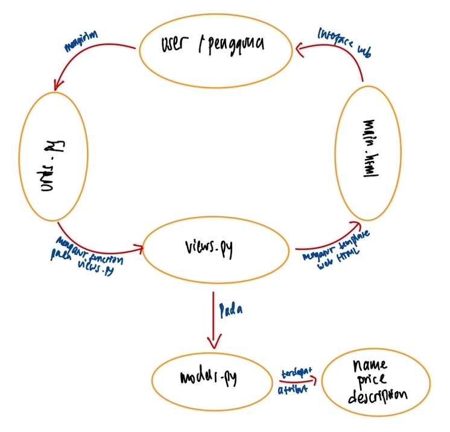
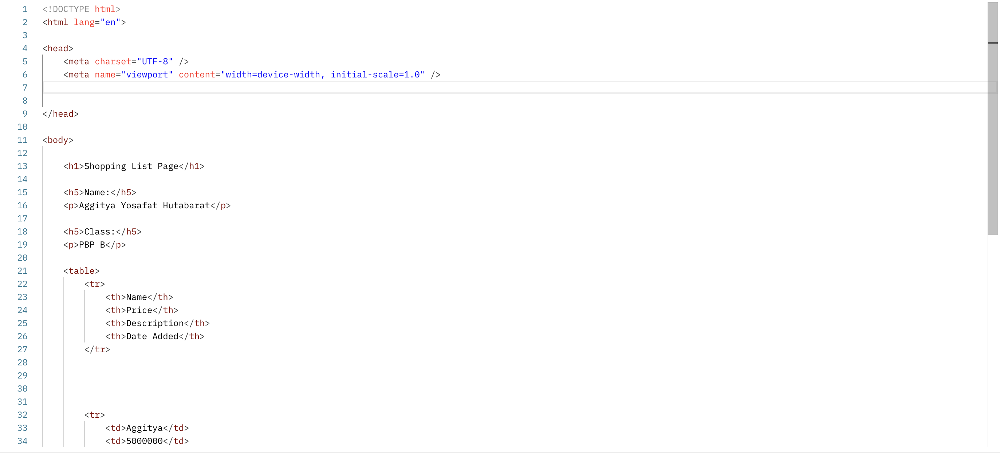
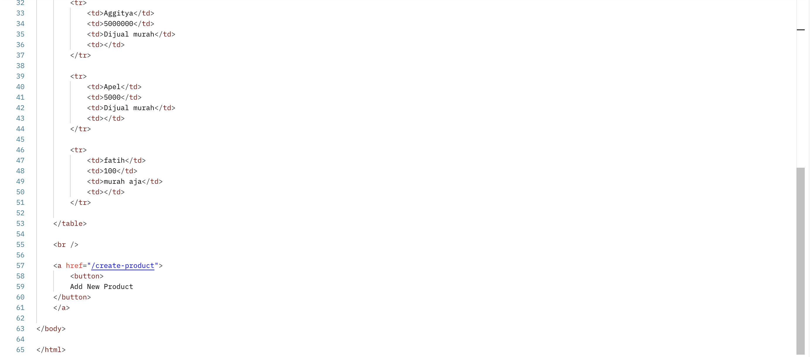
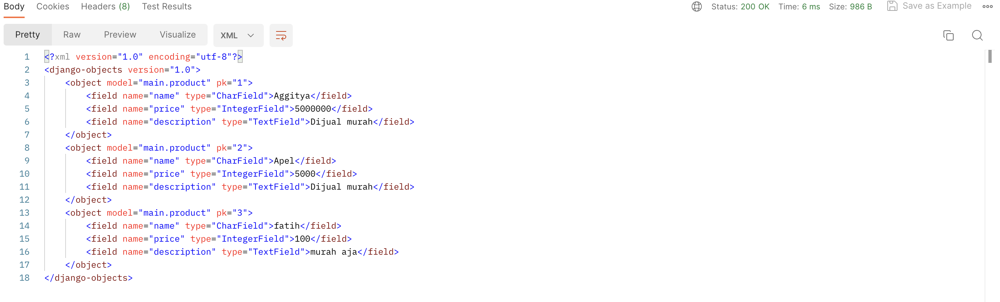
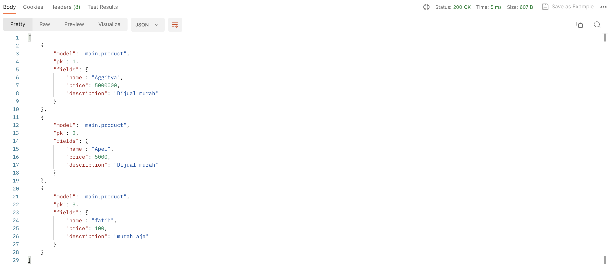
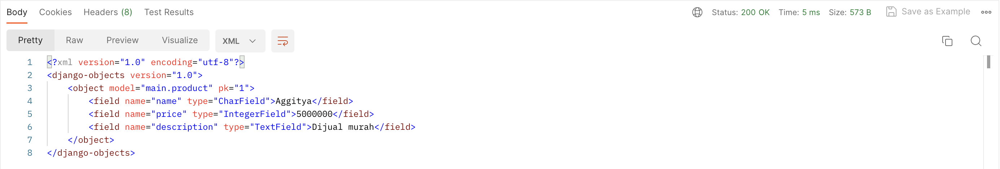
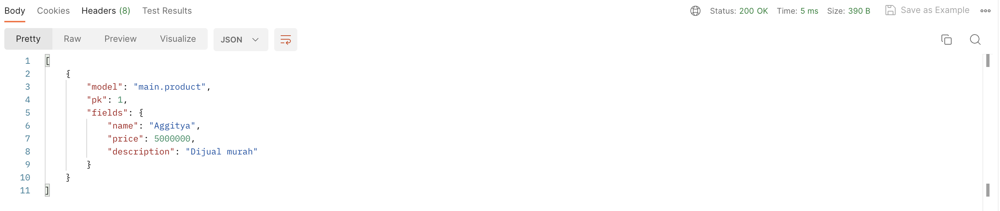

--- START TUGAS 2 ---

Jelaskan bagaimana cara kamu mengimplementasikan checklist di atas secara step-by-step (bukan hanya sekadar mengikuti tutorial).
Jawaban:
Untuk memulai proyek Django baru, ikuti langkah-langkah berikut:
1. Buat virtual environment dengan perintah python -m venv env.
2. Aktifkan virtual environment dengan perintah env\Scripts\activate.
3. Buat file requirements.txt untuk daftar dependensi proyek Anda.
4. Jalankan perintah pip install -r requirements.txt untuk menginstal dependensi yang diperlukan.
5. Mulai proyek Django dengan perintah django-admin startproject proyek_pbp.
6. Untuk pengaturan deployment, tambahkan "*" pada ALLOWED_HOSTS di dalam settings.py.
7. Pastikan untuk menambahkan file .gitignore untuk menentukan berkas-berkas dan direktori-direktori yang tidak perlu disertakan dalam repositori Git.
8. Buat aplikasi dengan perintah python manage.py startapp main.
9. Di dalam direktori main, buat folder templates dan tambahkan file main.html sebagai tampilan aplikasi.
10. Lakukan routing untuk aplikasi main dengan menambahkan path('main/', include('main.urls')) pada urls.py di dalam proyek library_col.
11. Buat model Item di dalam aplikasi main dengan atribut wajib: name (CharField), amount (IntegerField), dan description (TextField).
12. Tambahkan fungsi show_main pada views.py yang akan merender template HTML dengan konteks nama aplikasi, nama, dan kelas Anda.
13. Lakukan deployment ke Adaptable untuk memungkinkan teman-teman Anda mengaksesnya melalui Internet.
14. Lakukan add, commit, dan push dari direktori repositori lokal ke GitHub.
15. Ikuti petunjuk Tutorial 0 untuk melakukan deploy dari website Adaptable.
Semua langkah di atas akan membantu Anda memulai proyek Django baru dan melakukan deployment ke Adaptable.

Buatlah bagan yang berisi request client ke web aplikasi berbasis Django beserta responnya dan jelaskan pada bagan tersebut kaitan antara urls.py, views.py, models.py, dan berkas html.
Jawaban:

Jelaskan mengapa kita menggunakan virtual environment? Apakah kita tetap dapat membuat aplikasi web berbasis Django tanpa menggunakan virtual environment?
Jawaban:
Virtual environment adalah komponen kunci dalam pengembangan aplikasi web Django karena memberikan isolasi proyek yang memungkinkan pengelolaan dependensi secara efisien. Dengan menggunakan virtual environment, setiap proyek dapat memiliki lingkungan Python dan dependensi tersendiri yang terisolasi, menghindari potensi konflik dan masalah versi. Ini juga menyederhanakan tata kelola dependensi proyek.
Selain manfaat tersebut, penggunaan virtual environment juga meningkatkan keamanan proyek dengan mencegah potensi konflik antara paket-paket yang digunakan dalam proyek berbeda. Secara keseluruhan, penggunaan virtual environment adalah praktik terbaik dalam pengembangan aplikasi Django karena memastikan kebersihan, isolasi, dan manajemen dependensi yang efisien.

Jelaskan apakah itu MVC, MVT, MVVM dan perbedaan dari ketiganya.
Jawaban:
Model-View-Controller (MVC), Model-View-Template (MVT), dan Model-View-ViewModel (MVVM) adalah pola desain arsitektur yang digunakan dalam pengembangan perangkat lunak.
MVC membagi aplikasi menjadi tiga komponen utama: Model (penyimpanan data dan logika aplikasi), View (menampilkan data dari Model dan menghubungkannya dengan template), dan Controller (mengontrol tampilan antarmuka pengguna).
MVT, sejenis dengan MVC, memisahkan aplikasi menjadi Model (menyimpan data dan logika), View (menampilkan data dari Model dan menghubungkannya dengan template), dan Template (mengelola tampilan HTML dan cara data dari Model ditampilkan dalam halaman web).
MVVM juga memisahkan aplikasi menjadi Model (menyimpan data dan logika), View (menampilkan data dari Model dan menghubungkannya dengan template), dan memperkenalkan ViewModel. ViewModel bertanggung jawab untuk memproses data dari Model dan mempersiapkannya agar dapat ditampilkan oleh View. Hal ini memungkinkan pengikatan data yang kuat antara Model dan View.
Perbedaan utama antara ketiganya terletak pada bagaimana mereka mengelola alur dan logika aplikasi. MVC memiliki Controller yang mengontrol alur aplikasi, MVT menggantinya dengan Template untuk mengelola tampilan, dan MVVM memperkenalkan ViewModel sebagai perantara antara Model dan View.

--- END TUGAS 2 ---

--- START TUGAS 3 ---

Screenshot POSTMAN:
1. HTML

2. XML

3. JSON

4. XML by ID

5. JSON by ID

--- END TUGAS 3 ---